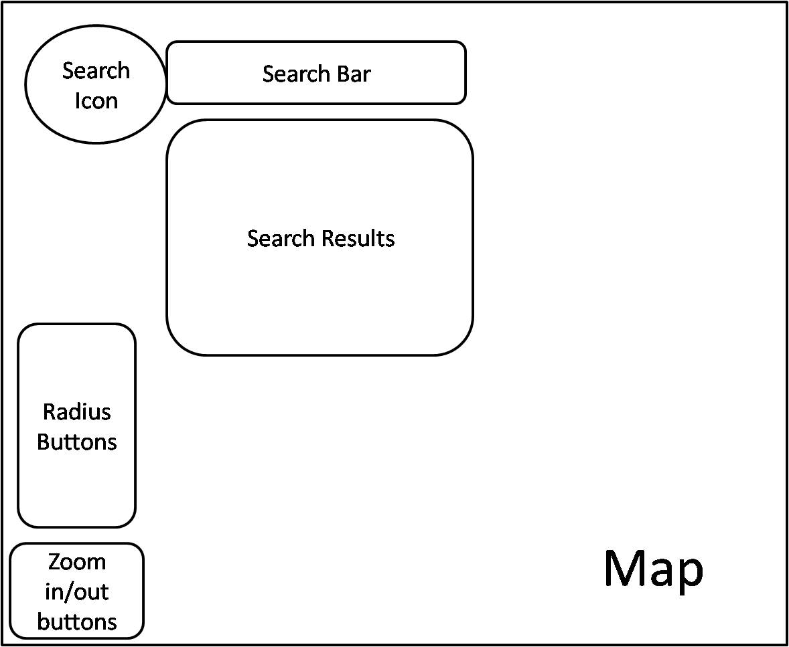
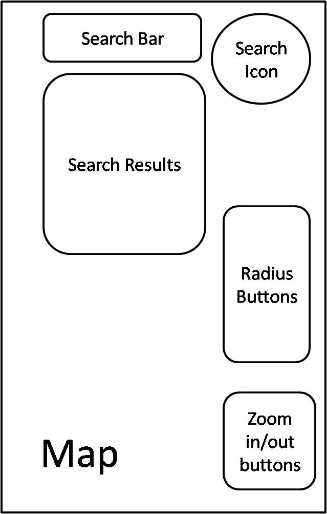
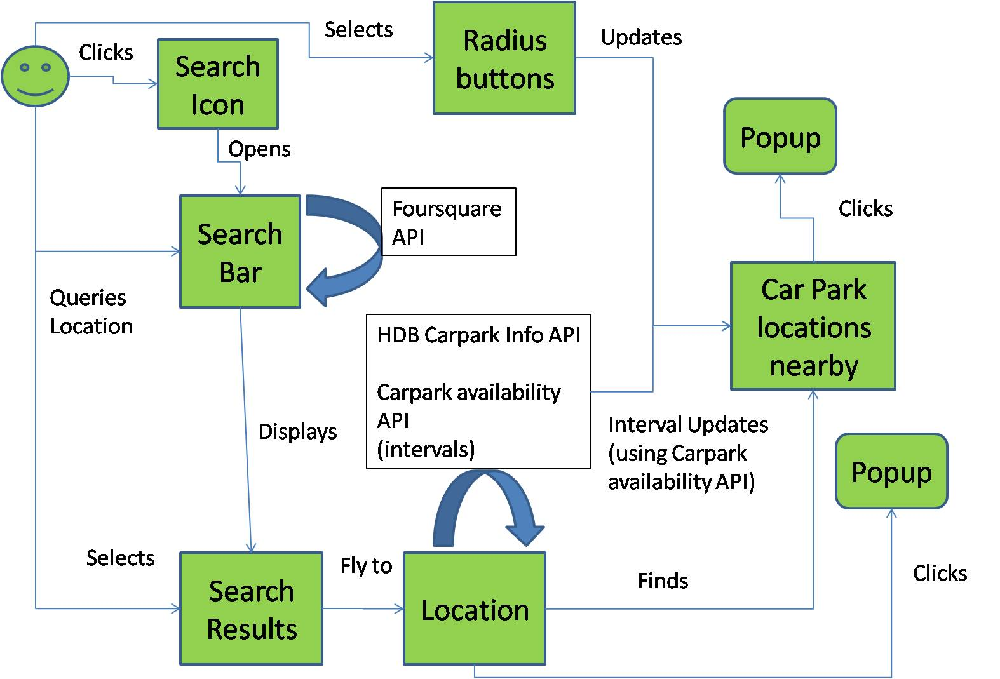

#  Car Park Finder
## Summary
This project aims to help drivers find and monitor car park capacity in Singapore so that they can plan their journey better.

<ins>Organisation goals:</ins>
 - Awareness of the traffic condition to make the journey on the road safe for the users and other drivers
	 - Driving safe includes being able to plan the journey well.

<ins>User goals:</ins>
 - Able to monitor and get data of car parks before starting the journey so that they know where to park once they reach the location.
 - Able to find the next best location to park if the intended car park is full. 
	 - Let's say the user have reached the location and the car park he intended to go happens to be full, he can check the app to find the next best location to park his vehicle without wasting time searching for it.
	 - Target Audiences: Drivers, especially car, lorry and motorbike drivers, as the API cater only to the three types of vehicles.

<ins>Motivation</ins>

This project is good, perhaps necessary for drivers in Singapore if they wish to have a smooth journey from start to end. We rarely consider car park spaces as part of planning our journey before driving.

 Bad planning before driving often leads to inconvenience or even danger to the user and other drivers on the road. It may also lead to unnecessary traffic congestion near the car parks in the event of functions or massive ceremonies.

<ins>URL to website</ins>

https://shadowbattalion.github.io/TrentGlobalProject1/

## Project Complexity

<ins>Dynamic Map Application</ins>

| Items | Quantity | Possible Score per Instance | Maximum | Total |
|--|--|--|--|--|
| Consume the GET endpoint of an API, or consume a CSV/JSON file | 3 |	 5| 12| 12 |
| Adding or removing DOM elements to the display(map, DOM tree, game screen) base on user's actions | 1 |8 | 20| 8 |
| Modifying the CSS of DOM elements based on the user's actions | 2 |5 | 12 | 10 |
| Use of 1D traversal of array | 3 |10| 15 | 15 |
| Each use of CSS layout technique (Bootstrap columns, flex box, grid) | 6 |	5 | 12 | 12 |
| Each case of the map updating base on the user's actions | 2  |5 | 12 | 10 |
| Each group of layers in the Leaflet map | 2 |	8 | 20 | 16 |
| Each group of marker clustering | 1 |	5 | 12 | 5 |
| Each type of custom marker (using images or custom behaviour) | 3 (time interval inclusive) |	8 | 20 | 20 |

<ins>Bonus</ins>

| Items | Quantity | Possible Score per Instance | Maximum | Total |
|--|--|--|--|--|
| Single Page Application | 1 | 15 | 15 | 15 |
|Use of model view controller|1|20|20|20|

## UI/UX
### Stratergy

<ins> User Stories </ins>

As a **driver**
I want to **check out if the car park is full before reaching the destination**
So that **I can plan my travel**

As a **driver**
I want to **find out the next best place to park my vehicle nearby**
So that **I can have backup options if the first chosen car park is full**

As a **driver**
I want to **to get updated information about the car park situation**
So that **so that the information will be accurate anytime**

As a **motorbike rider**
I want to **check if the the motorbike park is full or available before reaching the destination**
So that **I can plan my travel. Some car park have no motorbike section**

As a **lorry driver**
I want to **check if the the heavy vehicles park is full or available before reaching the destination**
So that **I can plan my travel. Not many places have heavy vehicles section**

<ins> Acceptance Criteria <ins>

 1. User can find a number of car park places nearby the location they intend to search
 2. User can find alternate car parks in the vicinity as a backup plan
 3. User can expand their area of search for car park around the location if the ones nearby are full 
 4. The information about the car park is always fresh and updated

	
 
 

### Scope
	
#### <ins> Functional requirements </ins>

Search Car Parks

 - Input
	 - User enters a location name to search.
 - Process
	 - Using Foursquare API, the search query can be sent to the API and the API will reply with a set of search results
 - Output
	 - A list of search results will be printed

 
	
 - Input
	 - User click on one of the places in the search result list
 - Process
	 -  The program will get the coordinates and bring the user to the specified location on the map
	 -  Car park status will be retrieved and will be marked on the map as well
	 - Car park markers will be located nearby the location of the chosen place
 - Output
	 -  User will be able to obtain the information of the place chosen and the car parks surrounding the place

 
	
Increase radius of search area

 - Input
	 - User can choose the search area of car park, based on the radius
 - Process
	 - The program will get the radius and add to the coordinates of the chosen place and only includes the car parks within the radius
 - Output
	 - New car park markers will be revealed for users reference 
	
 

Get updated car park information

The process of retrieving car park information will repeat with intervals

 
 
#### <ins> Non-functional requirements </ins>
	
 - Performance: the markers on the map should load fast and the user should be able to get the status of every car park in the area at a glance.
 - Mobile responsiveness: Should look clear and easy to read as user might need to decide the next best car park location while in the vehicle (while stopping somewhere)
 - Localization criteria: Only applicable in Singapore as the car park information are taken from the local government API
 - Accessibility criteria: Targert users are fit drivers
 - Not applicable:
 - Privacy: No user information will be needed
 - Security: Security is based on the server that provides the API. 
	

 
 
	
### Structure
Structure used: 

 - Linear
 

Information organisation: 

 - User interaction elements like buttons, will be in the periphery as much as possible in order to not obstruct the users view of the map.
 - Main information like the car park and the location information can only appear whenever the user needs it. It will be stored in popup boxes where users can toggle the content to appear or disappear.
	
 
 
	
### Skeleton
The idea of simplicity and fast interaction for users in order to get the information at a quick glance

Desktop Mockup:

	
Mobile Mockup:

### Surface Plane

 - Appearance
	 - Typography:
		 - Comfortaa: For main titles. Comfortaa is strong to give the impression of confidence to drivers while at the same time looks comfortable as the font look spacious
		 - Montserrat: For contents. To complement Comfortaa font
	 - Color : 
		 - #273b8a : Primary color. Based on LTA logo. Only used for big texts and main titles 
		 - #dedede: Secondary color. Doesn't cause much contrast with the primary color.
		 - white: For informational popups where the word sizes are smaller
		 - black: To highlight clicked buttons.
	 - Font Size: 
		 - Where possible, important texts needs to be big as drivers might have strained their eyes from driving and they don't need to further strain their eyes while using the app.
	 - Layout: 
		 - As spread out as possible as users might be in the car stopping by the road to get quick and easy information in the case where users need to find a second best car park. 
 - Mobile Responsiveness: 
	 - This is achieved by starting from the mobile layout. The most important thing to keep track is the size of components, like words, icons etc. Because this will change when the website runs on a bigger screen, therefore the size of the components and the screens must be proportionate.
	 - The rest of the functionalities are done in mobile display and will be adjusted accordingly if the screen size affects the said functionalities.

## Features
### Feature List

 1. Retractable animation to make the UI less obstructive for the users whenever they need to use the map
 2. Search bar
 3. Search results
 4. Location information
 5. Car park locations nearby
 6. Car Park icons designed to display car park status at a glance
 7.  Car Park status is updated in intervals without updating the whole map
 8.  Adjustable search radius of car parks around the selected location

### Feature Flow

### Future Implementation

 1. Users can choose whether to display the search and radius controls on the left side or the right side of the mobile screen. Some users might be left handed.
 2. The radius button panel turns out to be a bit obstructive. A new design is perhaps needed.
 3. Location search filter.
 4. Users can control the zoom level based on the radius that they have chosen. For example, then the user increases the radius, the zoom level will increase to correspond with the radius, so that the whole search radius can be seen automatically, without having the user zooming out manually 

### Bugs
Currently, the car park popup box will disappear once the new interval starts. This is to update the information in the popup box. A new API call will be made after every interval and a new marker will replace the old ones. Which will caused the popup box disappear and users will have to click on the icons to see the updated information.

I would like to see the effect where only the content of the popup box will be updated while the popup box appears on the screen and not disappear after every interval. Currently I couldn't find a way to do that

## Technology Used

 - Axios
	 - It is a technology used to give the program HTTP client capability
	 - Purpose: It used to make HTTP requests to APIs/URLs to retrieve data from the server
	 - https://github.com/axios/axios

 - Foursquare
	 - A technology that provides the users location information of places that are searched. 
	 - Purpose: Provides location information of searched places like the latitude and longitude which can be used in conjunction with libraries like Leaflet to print markers on the map.
	 - https://foursquare.com/

 - Leaflet/Leaflet Clustering
	 - An interactive map where users can mark location based on longitude and latitudes. It also have utilities to customize and enhance the usage
	 - Clustering is a technology which will cluster nearby markers based on zoom level into one consolidated marker
	 - Purpose: Used to visualise the map and make it more interactive
	 - https://github.com/Leaflet/Leaflet

 - OpenStreetMap
	 - A community owned map that has underlying geodata which can be used by other libraries to manipulate it. It is what Leaflet is based on.
	 - Purpose: A map created by the community so that it can be used universally 
	 - https://www.openstreetmap.org/

 - SVY21 converter
	 - Latitude and longitude are using the WGS 84 format. The car park data from data.gov.sg are useing the SVY21 format. This library can convert from SVY21 to WSG84
	 - Purpose: Used to convert SVY21 coordinates to WGS 84 which can then be accepted as parameters by Leaflet markers
	 - https://github.com/cgcai/SVY21/tree/master/Javascript

 - Bootstrap CSS
	 - A library which has pre-made css components
	 - Purpose: for fast building of CSS on websites
	 - https://getbootstrap.com/

 - Google Fonts
	 - Additional fonts for HTML
	 - https://fonts.google.com/
	
##  Testing

| Test Case # | Test Case Description |Test Steps|Expected Result|
|--|--|--|--|
| 1 | User accesses the main URL | <ol><li>Go to https://shadowbattalion.github.io/TrentGlobalProject1/ </li></ol> | The website should appear with the welcome banner and a map for its background. There should be a button with magnifying glass on top left/right corner of the website ; depends on the screen size of the device  |
| 2| User searches for location and its nearby car parks statuses  |<ol><li>Click on the search icon (magnifying-glass)</li><li>Type in search query "Evergreen" and click the "Search" button</li><li>Click on "Evergreen Secondary School" from the search results</li></ol>|The welcome banner will disappear. The website will then "flyto" the specified location and will show the nearby car park icon markers. The icon will show how occupied each car park is, based on the image of the icon.|
| 3|  User wants to know more about the car park|<ol><li>Click on the car park icon</li><li>Click on the "Parking Details" tab</li></ol> |A popup will open and will show 4 tabs which users can choose from to understand the car park situation.|
| 4| User wants the car park search to cover a bigger radius  |<ol><li>Click on the "300m" radius buttons</li></ol>|The circle around the chosen location will expand to 300m and new new car park icons will appear.|
| 5a| User wants to look for another location (from the current search result)|<ol><li>Click on the search icon (magnifying-glass)</li><li>Click on "Evergreen Primary School"</li></ol>|The website will then “flyto” the specified location and will show the nearby car park icon markers. The icon will show how occupied each car park is, based on the image of the icon.|
| 5b| User wants to look for another location (new search query)|<ol><li>Click on the search icon (magnifying-glass)</li><li>Type in search query "Bishan" and click the "Search" button</li><li>Click on "Bishan MRT Interchange (NS17/CC15)" from the search results</li></ol>|The website will then “flyto” the specified location and will show the nearby car park icon markers. The icon will show how occupied each car park is, based on the image of the icon.|

## Deployment	
Deployed on Git Pages

## Credits
| Acknowledgements | Link |
|--|--|
| Axios | https://github.com/axios/axios|
|Foursquare| https://foursquare.com/ |
|Leaflet/Leaflet Clustering|https://github.com/Leaflet/Leaflet|
|OpenStreetMap|https://www.openstreetmap.org/|
|Map Box|https://www.mapbox.com/|
|SVY21 converter|https://github.com/cgcai/SVY21/tree/master/Javascript|
|HDB Car Park|https://data.gov.sg/dataset/hdb-carpark-information|
|Car Park Availability|https://data.gov.sg/dataset/carpark-availability|
|Bootstrap CSS|https://getbootstrap.com/|
|Google Fonts|https://fonts.google.com/|

